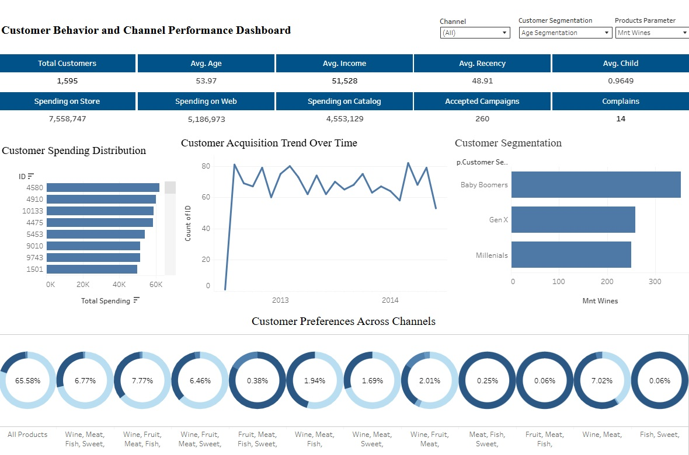

# 🛒 Customer Purchasing Behavior Analysis Across Web, Catalog & Store Channels

> Exploratory data analysis of supermarket customer purchasing patterns across three channels — uncovering behavioral differences by generation and channel to guide targeted marketing strategy.

**Solo Project** | Purwadhika Digital Technology School — JCDSOL-015
Author: Mochamad Aditya Putra Yudha Kusuma

---

## 📊 Dashboard Preview

### Power BI

*Take a screenshot of your Power BI dashboard and upload it to this repo*

### Tableau

📎 [View Interactive Tableau Dashboard](https://public.tableau.com/app/profile/aditya.putra5948/viz/DashboardforSupermarketsManagement/CustomerBehaviorandChannelPerformanceDashboard2?publish=yes)

---

## 📋 Table of Contents

- [Problem Statement](#problem-statement)
- [Project Objectives](#project-objectives)
- [Dataset Overview](#dataset-overview)
- [Methodology](#methodology)
- [Key Findings](#key-findings)
- [Recommendations](#recommendations)
- [Tech Stack](#tech-stack)
- [Repository Structure](#repository-structure)
- [Links](#links)

---

## Problem Statement

In the retail industry, understanding *how* customers buy is just as important as understanding *what* they buy. Supermarkets operating across multiple channels — web, catalog, and physical store — face a critical strategic question: are customers behaving differently across these channels, and if so, how should marketing and operations adapt?

This project analyzes supermarket customer data to answer one central question:

> **"What are the main differences in purchasing behavior between Web, Catalog, and Store channels?"**

Understanding these differences enables more precise targeting — directing the right promotions to the right customers through the right channel — rather than applying a one-size-fits-all marketing strategy.

---

## Project Objectives

- Identify behavioral differences in purchase frequency across Web, Catalog, and Store channels
- Analyze how generational segments (Millennials, Gen X, Baby Boomers) interact with each channel differently
- Understand product category preferences across channels (Wine, Meat, Fruits, Fish, Sweets)
- Translate EDA findings into concrete, channel-specific marketing recommendations
- Deliver insights through an interactive Power BI dashboard for management use

---

## Dataset Overview

| Item | Detail |
|---|---|
| Source | Purwadhika — Supermarket Customer dataset |
| Raw records | 2,240 rows |
| Cleaned records | 1,572 rows |
| Period | Not specified in dataset |
| Geography | Not explicitly identified in dataset |
| Segments analyzed | 4 generational groups × 3 purchase channels |

> **Note on geography:** The dataset does not explicitly identify customer regions. The original project description referenced EU & NA comparisons, but this could not be verified from the data itself. Analysis focuses on behavioral patterns across channels and generations, which are fully supported by the data.

### Data Dictionary

| Feature | Description |
|---|---|
| `Year_Birth` | Customer birth year (used to derive generation segment) |
| `Education` | Highest education level attained |
| `Marital_Status` | Customer marital status |
| `Income` | Annual household income |
| `Kidhome` | Number of children at home |
| `Teenhome` | Number of teenagers at home |
| `Dt_Customer` | Date of customer registration |
| `Recency` | Days since last purchase |
| `MntWines` | Amount spent on wine in last 2 years |
| `MntFruits` | Amount spent on fruits in last 2 years |
| `MntMeatProducts` | Amount spent on meat in last 2 years |
| `MntFishProducts` | Amount spent on fish in last 2 years |
| `MntSweetProducts` | Amount spent on sweets in last 2 years |
| `MntGoldProds` | Amount spent on premium/gold products in last 2 years |
| `NumWebPurchases` | Number of purchases made via website |
| `NumCatalogPurchases` | Number of purchases made via catalog |
| `NumStorePurchases` | Number of purchases made in-store |
| `NumWebVisitsMonth` | Number of website visits per month |
| `NumDealsPurchases` | Number of purchases made with a discount |
| `AcceptedCmp1–5` | Whether customer accepted offer in campaigns 1–5 |
| `Response` | Whether customer responded to the latest campaign |
| `Complain` | Whether customer complained in the last 2 years |

---

## Methodology

### 1. Data Cleaning
- Handled missing values, duplicates, and anomalies
- Removed outliers to improve analysis reliability
- Final dataset: 1,572 cleaned customer records

### 2. Feature Engineering
- Derived **Age** from `Year_Birth` and current year
- Created **Generation** segments:
  - Millennials: 25–40 years old
  - Gen X: 41–56 years old
  - Baby Boomers: 57–75 years old
- Calculated **average purchase frequency per channel** per customer

### 3. Exploratory Data Analysis (EDA)
Analysis structured around the central question: *Web vs Catalog vs Store — what's different?*

- Channel purchase frequency comparison across the full dataset
- Generational breakdown of purchase frequency per channel
- Product category spending distribution across channels
- Average spend per purchase by channel

---

## Key Findings

### Channel Purchase Frequency

| Channel | Average Purchases per Customer |
|---|---|
| **Store** | **5.77** ← dominant channel |
| Web | 3.30 |
| Catalog | 2.60 |

**Store is the dominant channel** across all customer segments. Customers visit physical stores nearly twice as often as they shop via web or catalog.

---

### Average Spend per Purchase by Channel

| Channel | Average Spend per Purchase |
|---|---|
| **Catalog** | **1,103** ← highest spend |
| Store | 821 |
| Web | 812 |

**Catalog drives the highest spend per transaction** — 34% higher than Store, despite lower purchase frequency. This suggests catalog customers are more deliberate and high-value per transaction, even if they buy less often.

> Currency not specified in dataset — values represent raw spend units from the data.

---

### Purchase Frequency by Generation and Channel

| Generation | Web | Catalog | Store |
|---|---|---|---|
| **Baby Boomers** | **4.51** | **3.03** | **6.25** |
| Gen X | 3.76 | 2.25 | 5.42 |
| Millennials | 3.15 | 2.36 | 5.46 |

**Key pattern:** Baby Boomers are the most active buyers across every channel — store, web, and catalog. Millennials are consistently the lowest frequency buyers across all three channels.

Notably, **Store is the preferred channel for every generation** — not just older customers. Even Millennials buy in-store more than twice as often as they buy via catalog.

---

### Product Category Preferences

**Wine dominates across all channels** — accounting for more than 50% of total spend across Web, Catalog, and Store. This suggests wine is a high-demand, cross-channel product that should anchor promotional strategy regardless of channel.

Top category spend order across all channels:
1. Wine (>50% of total spend)
2. Meat
3. Gold/Premium products
4. Fish
5. Fruits & Sweets (lowest)

---

## Recommendations

### Channel Strategy

**Double down on Store** — it's the dominant channel for every generation. In-store experience, layout, and promotional placement should be the primary investment focus.

**Treat Catalog as a high-value, low-frequency channel** — catalog buyers spend 34% more per transaction. Rather than increasing catalog volume, focus on curating high-margin, high-ticket offerings in catalog communications to maximize spend per transaction.

**Use Web for acquisition and engagement** — web has moderate frequency and low spend per purchase. It's best positioned as a discovery and engagement channel, not the primary conversion channel. Consider improving the web experience for Millennials who are the least frequent buyers overall.

### Generational Targeting

**Baby Boomers** are the highest-value segment across all channels. Marketing spend should be proportionally allocated toward this group — both in-store promotions and catalog offers.

**Millennials** show the lowest purchase frequency across all channels — consider loyalty programs, subscription options, or convenience features (same-day delivery, click-and-collect) to increase their engagement.

**Gen X** sits in the middle — responsive to both in-store and web channels. A cross-channel strategy works best for this segment.

### Product Strategy

**Wine is a universal anchor** — promotional campaigns built around wine have the broadest reach across channels and generations. Bundle wine with underperforming categories (fruits, sweets) to lift their performance.

**Focus premium/gold products in catalog** — high-spend catalog customers are the most likely segment to respond to premium product offerings.

---

## Tech Stack

| Category | Tools |
|---|---|
| Language | Python |
| Data Manipulation | Pandas, NumPy |
| Visualization | Matplotlib, Seaborn |
| BI & Dashboards | Power BI, Tableau |
| Environment | Google Colab |
| Version Control | GitHub |

---

## Repository Structure

```
Customer-Purchasing-Behavior-Analysis/
│
├── Capstone_2_(Supermarket_Customer).ipynb  # Main analysis notebook
├── Capstone 2 ppt.pptx                      # Project presentation slides
├── Supermarket Dashboard.pbix               # Power BI dashboard file
├── Supermarket Customers.csv                # Raw dataset
├── Supermarket_Customer_Cleaned.csv         # Cleaned dataset
└── README.md
```

---

## 🔗 Links

| Resource | Link |
|---|---|
| 📓 Notebook (Google Colab) | [Open Notebook](https://colab.research.google.com/drive/1OgbmvOuiL5LmcMg4hWDoMyzt5sOUyQW_?usp=sharing) |
| 📊 Power BI Dashboard | [View on Google Drive](https://drive.google.com/file/d/1eZgWbMMkgVmCsCUI5wN_r0GdooPXBnNX/view?usp=sharing) |
| 📈 Tableau Dashboard | [View on Tableau Public](https://public.tableau.com/app/profile/aditya.putra5948/viz/DashboardforSupermarketsManagement/CustomerBehaviorandChannelPerformanceDashboard2?publish=yes) |
| 🎤 Presentation (Video) | [Watch on Google Drive](https://drive.google.com/file/d/1eyMCg-rroNzz1jNIKFkWgkvFrBDgpWgR/view?usp=sharing) |
| 📑 Presentation (Slides) | [Open Slides](https://docs.google.com/presentation/d/1yjvG5Rbu35j1LL-Ugk5ycrUMSTz2IccZ/edit?usp=drive_link) |
